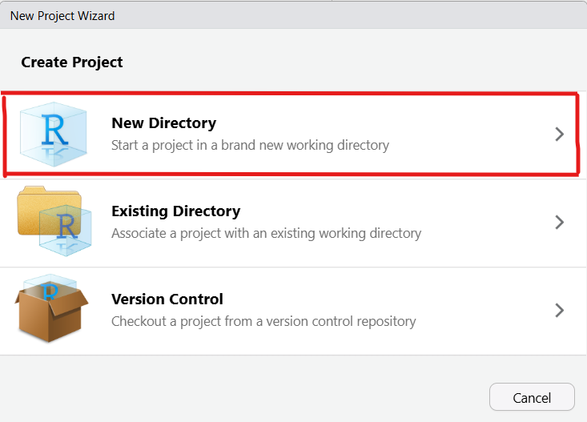
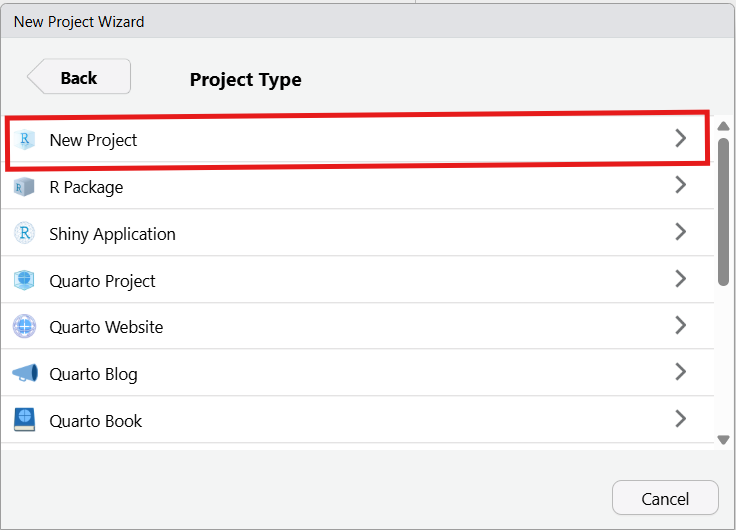

<!-- README.md is generated from README.Rmd. Please edit that file -->

```{r, include = FALSE}
knitr::opts_chunk$set(
  collapse = TRUE,
  comment = "#>",
  fig.path = "man/figures/README-",
  out.width = "100%"
)
```

# cleaningkit

`cleaningkit` is an R package built to help clean and validate survey data (especially Ona surveys).

## Installation

```r
# install.packages("pak")
pak::pak("mixedmigrationcentre/cleaningkit")
```

## User Guides

### 1. Create a project

Open RStudio and go to **File > New Project...** to open the New Project Wizard.

Choose **New Directory**:



Choose **New Project**:



Type a project name (1), **Browse...** to the folder where the project should sit (2), then click **Create Project** (3):


### 2. Add the example scripts

The two files below contain the actual working code for the whole workflow. Download them from GitHub (open the file, then use the download raw file button) and copy them into your new project directory:

* [1-cleaning_and_validation.R](https://github.com/mixedmigrationcentre/cleaningkit/blob/main/inst/examples/1-cleaning_and_validation.R)
* [2-create_clean_data.R](https://github.com/mixedmigrationcentre/cleaningkit/blob/main/inst/examples/2-create_clean_data.R)

## How to use it

Before running any other functions, you need to run `load_packages()`. This ensures that all required dependencies for `cleaningkit` are installed and loaded properly.

```r
library(cleaningkit)
load_packages()

# create project folders (run once)
setup_project_folders(
  base_path = here::here(),
  extra_folders = NULL # any site-specific extras
)
```

### Preparing the Data for a New Validation Round

```r
# reduces a cumulative ONA export to the records collected since the last
# validation round, and writes them to data/data.xlsx
filter_new_records(
  data_folder = "./data",
  uuid_column = "_uuid",
  skip_label_row = TRUE,
  output_name = "data.xlsx",
  use_ledger = TRUE, # filter against data/processed_uuids.csv
  archive = TRUE     # move the inputs to data/archive/
)
```

Skip this step for the first round, or when the whole dataset is being validated in one go.

### Data Cleaning and Validation

The package provides a suite of `validate_*` functions to run various data quality checks. Each function returns a list containing the checked dataset and a log of flagged issues.

```r
library(cleaningkit)

# Load your raw data and tool survey schema
raw_data <- read_raw_data("path/to/data.xlsx", tool_survey = survey_sheet)

# Run validations (each step passes the result to the next)
checked_data <- raw_data |>
  # 1. Survey duration makes sense (e.g. between 15 and 60 minutes)
  validate_duration(column_to_check = "_duration", lower_bound = 15, upper_bound = 60) |>
  # 2. Minimum of 100 answered questions
  validate_completeness(min_content_cells = 100) |>
  # 3. Maximum of 6 "Refused" answers
  validate_refused(max_refused = 6) |>
  # 4. Interviews conducted at a plausible time (e.g. between 5am and 10pm)
  validate_interview_time(earliest_hour = 5, latest_hour = 22) |>
  # 5. Suspiciously similar responses (soft duplicates differing in <= 7 columns)
  validate_similar_surveys(tool_survey = survey_sheet, threshold = 7) |>
  # 6. Repeated answers for specific questions by the same enumerator
  validate_similar_questions(questions_to_check = c("Q161_1", "Q162_1")) |>
  # 7. Outliers in all integer columns in the dataset or particular columns
  validate_outliers(
    columns_to_check = c("Q141_3"),
    strongness_factor = 3,
    min_unique_values = 5) |>
  # 8. Country of interview shouldn't match nationality or journey start
  validate_country_of_interview() |>
  # 9. Implausible back-to-back interviews (gap < 10 minutes)
  validate_back_to_back(threshold_mins = 10) |>
  # 10. Spatial distance between two interviews per enumerator or for the entire dataset
  validate_spatial_proximity(
    lat_column = "_location_latitude",
    lon_column = "_location_longitude",
    uuid_column = "_uuid",
    enumerator_column = "username",
    log_name = "spatial_proximity_log",
    distance_threshold_m = 50) |>
  # 11. GPS point matches the claimed country and city of interview
  validate_interview_location(
    country_question = "Q13",
    city_question = "Q14",
    city_radius_km = 75) |>
  # 12. External logical checks (requires a checklist dataframe)
  validate_logical_with_list(
    list_of_check = logical_list,
    check_id_column = "check_id",
    check_to_perform_column = "check_to_perform",
    columns_to_clean_column = "columns_to_clean",
    description_column = "description")

# Look at the issues logged for any of the checks
print(checked_data$duration_log)
print(checked_data$back_to_back_log)
```

### Logical Checks

Logical checks are the consistency rules of the questionnaire — the "this answer cannot go together with that answer" rules, such as a respondent being interviewed in their own country of nationality. They are **not** written in R. They live in an Excel checklist so that research staff can add, edit or retire a check without touching any code, and `validate_logical_with_list()` runs every row of that checklist against the dataset.

**Where to find the template.** A ready-made checklist containing the standard MMC core checks ships with the package. Copy it into your project's `resources/` folder and edit it there:

```r
# where the template lives on your machine
template_path <- system.file(
  "extdata", "logical_checklist_example.xlsx", package = "cleaningkit"
)

# copy it into your project so you can edit it
file.copy(template_path, "./resources/logical_checks_mmc.xlsx")
```

You can also browse it on GitHub under [`inst/extdata/logical_checklist_example.xlsx`](https://github.com/mixedmigrationcentre/cleaningkit/blob/main/inst/extdata/logical_checklist_example.xlsx).

**How the checklist is structured.** Each row is one check. Four columns are read by the function (`module` is optional and only helps you organise the sheet):

| Column | What it holds |
|---|---|
| `check_id` | Unique id for the check, e.g. `check_01`. Duplicates raise an error. Used in the log and in `check_binding`. |
| `description` | Plain-language explanation of what is wrong — this is what the reviewer reads in the cleaning log. |
| `check_to_perform` | An R expression, written as text, that is `TRUE` for the records to flag, e.g. `Q13 == Q31`. |
| `columns_to_clean` | Comma-separated list of the columns the reviewer should look at, e.g. `Q13, Q31`. One log row is produced per flagged record **per column**. Leave blank if there is no specific column to clean. |

An example row would look like this:

| module | check_id | description | check_to_perform | columns_to_clean |
|---|---|---|---|---|
| core | check_01 | Country of nationality matches current country of interview. Verify respondent's nationality. | `Q13 == Q31` | `Q13, Q31` |

**Writing `check_to_perform`.** The expression is evaluated inside `dplyr::filter()`, so column names are written bare (no quotes, no `df$`) and any `dplyr` or `stringr` verb can be used:

```r
# straightforward comparison of two questions
Q13 == Q31

# either of two conditions
(Q92 == Q31) | (Q92 == Q41)

# select_multiple questions are exported as one space-separated string,
# so test them with str_detect() + fixed(), never with ==
str_detect(Q78, fixed("Natural disaster or environmental factors")) & Q86_a == "No"
```

**Running the checks.**

```r
logical_list <- openxlsx::read.xlsx("./resources/logical_checks_mmc.xlsx", sheet = 1)

logical_check_log <- raw_data |>
  validate_logical_with_list(
    list_of_check = logical_list,
    check_id_column = "check_id",
    check_to_perform_column = "check_to_perform",
    columns_to_clean_column = "columns_to_clean",
    description_column = "description"
  )

# all checks stacked into one log
logical_check_log$logical_log

# a flag column is also added to the dataset for every check
table(logical_check_log$checked_dataset$check_01)
```

By default all checks are stacked into a single `logical_log`. Set `bind_checks = FALSE` to store each check in its own log named after its `check_id` (`logical_check_log$check_01`), which is useful when a single check needs to be inspected on its own. If a check is written badly the function stops and prints both the `check_id` and the offending expression, so you know exactly which row of the Excel sheet to fix.

### Combining and Exporting Logs

After running the validation checks, you can combine all the individual logs and save them into an Excel file for review and follow-up:

```r
#----------------------------------
# combine logs
#----------------------------------
combined_log <- cleaningkit::create_combined_log(
  list_of_log = checked_data,
  dataset_name = "checked_dataset"
)

#----------------------------------
# create the review workbook
#----------------------------------

# vba = FALSE (default) -> plain .xlsx workbook
# vba = TRUE            -> macro-enabled .xlsm; edits made on the `dataset`
#                          sheet are appended to the `cleaning_log` sheet
cleaningkit::create_review_workbook(
  write_list = combined_log,
  other_responses = other_responses_df,
  other_db = other_db,
  vba = FALSE,
  output_path = paste0(
    "path/to/output/",
    Sys.Date(),
    "_follow-ups.xlsx"
  )
)
```

### Creating Other Responses

```r
# Prepare the other responses dataframe
other_responses_df <- prepare_other_responses(
  raw_data = raw_data,
  other_db = other_db,
  tool_choices = choices_sheet
)

# Usual route: pass it to create_review_workbook() - see above

# Or a standalone file for review
save_other_responses(
  df = other_responses_df,
  other_db = other_db,
  save_location = "output"
)
```

### Apply Cleaning

Once the cleaning logs and other responses have been reviewed and edited, you can apply these changes to produce the final clean dataset.

```r
#----------------------------------
# apply cleaning
#----------------------------------
cleaning_log <- read_cleaning_log(path = "path/to/output/", raw_dataset = raw_data)
evaluated_log <- evaluate_cleaning_log(cleaning_log = cleaning_log, raw_dataset = raw_data)
cleaned_data_list <- apply_cleaning_log(raw_dataset = raw_data, cleaning_log = evaluated_log$cleaning_log)

# the same reviewed workbook - each reader finds its own sheet by name
other_log <- read_other_responses(path = "path/to/output/", dataset = raw_data, other_db = other_db, tool_choices = choices_sheet)
cleaned_data_list <- apply_other_responses(dataset = cleaned_data_list$clean_dataset, other_log = other_log)

#----------------------------------
# combine cleaning logs
#----------------------------------
final_log <- combine_reviewed_logs(main_log = evaluated_log$cleaning_log, other_log = other_log, dataset = raw_data)

#----------------------------------
# review clean dataset
#----------------------------------
review_log <- review_cleaned_data(raw_dataset = raw_data, clean_dataset = cleaned_data_list$dataset, cleaning_log = final_log)

#----------------------------------
# create final workbook
#----------------------------------
export_final_output(
  raw_dataset = raw_data,
  clean_dataset = cleaned_data_list$dataset,
  combined_log = final_log,
  output_path = "output/final/final_output.xlsx"
)
```
