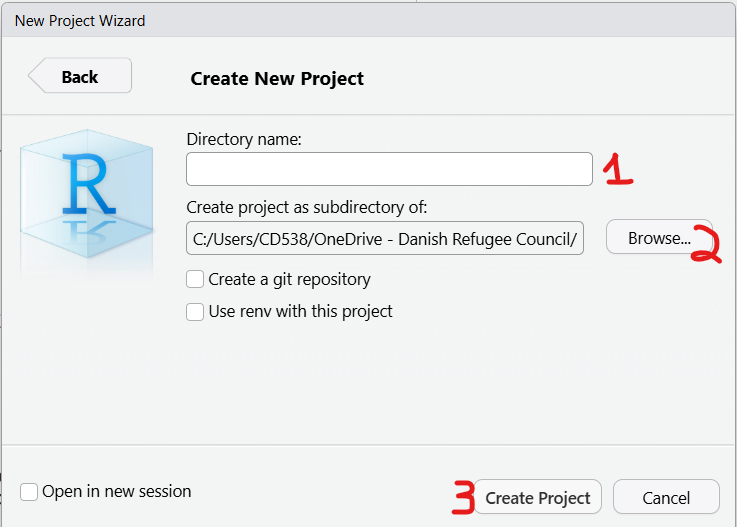
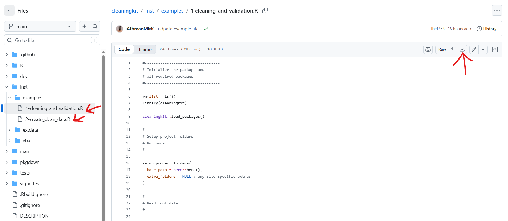

# cleaningkit

`cleaningkit` is an R package built to help clean and validate survey
data (especially Ona surveys).

## Before you start

`cleaningkit` is an R package, so you need two free programs installed,
in this order:

- [R](https://cran.r-project.org/) — the language the package runs on
- [RStudio Desktop](https://posit.co/download/rstudio-desktop/) — the
  editor you will actually work in

## How the script is organised

The pipeline is a series of functions, and the sections of this guide
follow the example script one function at a time. Each one does a single
job — flagging short interviews, flagging outliers, building the review
workbook — and each has a *Customise* line telling you which arguments
to adapt to your own survey. Not every check applies to every survey: to
switch one off, select its lines in RStudio and press **Ctrl+Shift+C**
(**Cmd+Shift+C** on macOS), which comments them out. Pressing it again
brings them back, so you never have to delete anything. Remember to
comment out the matching entry in `list_of_log_all` further down as
well.

## Installation

``` r

# install.packages("pak")
pak::pak("mixedmigrationcentre/cleaningkit")
```

## User Guides

### 1. Create a project

Open RStudio and go to **File \> New Project…** to open the New Project
Wizard.

| Choose **New Directory**: | Choose **New Project**: | Type a project name (1), **Browse…** to the folder where the project should sit (2), then click **Create Project** (3): |
|:--:|:--:|:--:|
|  |  |  |

### 2. Add the example scripts

The two files below contain the actual working code for the whole
workflow. Download them from GitHub (open the file, then use the
download raw file button) and copy them into your new project directory:



- [1-cleaning_and_validation.R](https://github.com/mixedmigrationcentre/cleaningkit/blob/main/inst/examples/1-cleaning_and_validation.R)
- [2-create_clean_data.R](https://github.com/mixedmigrationcentre/cleaningkit/blob/main/inst/examples/2-create_clean_data.R)

## How to use it

Before running any other functions, you need to run
[`load_packages()`](reference/load_packages.md). This ensures that all
required dependencies for `cleaningkit` are installed and loaded
properly.

*Customise:* `base_path` is the project root
([`here::here()`](https://here.r-lib.org/reference/here.html) keeps it
portable) and `extra_folders` adds any site-specific folders.
[`setup_project_folders()`](reference/setup_project_folders.md) also
copies `logical_checklist.xlsx` into `resources/` — pass
`copy_templates = FALSE` to skip that, or `templates` to copy it under a
different name.

``` r

library(cleaningkit)
cleaningkit::load_packages()

# create project folders (run once)
cleaningkit::setup_project_folders(
  base_path = here::here(),
  extra_folders = NULL # any site-specific extras
)
```

This creates the folder structure the rest of the pipeline reads from
and writes to. Two folders hold what you put in, three hold what comes
out:

| Folder | In / out | What lives there |
|----|----|----|
| `data/` | input | The raw ONA export for the round. [`filter_new_records()`](reference/filter_new_records.md) also keeps its archive and its `processed_uuids.csv` ledger here. |
| `resources/` | input | The XLSForm tool (`tool.xlsx`) and the logical checks (`logical_checklist.xlsx`, copied in for you). |
| `output/` | output | Anything the pipeline writes that is not a follow-up or a final file. |
| `output/follow_ups/` | output | One review workbook per validation round — the cleaning log and other responses that go out for review, and the edited file that comes back. |
| `output/final/` | output | The final clean dataset, written at the end by [`export_final_output()`](reference/export_final_output.md). |

Only `data/` and `resources/` need anything from you. Everything under
`output/` is created by the pipeline, so there is no need to put files
there by hand.

### Preparing the Data for a New Validation Round

*Customise:* `data_folder` and `output_name` if your exports do not live
at `./data/data.xlsx`; `uuid_column` if the id column is not `_uuid`;
`use_ledger = FALSE` to compare only against the previous file instead
of the running ledger; `archive = FALSE` to leave the inputs where they
are.

``` r

# reduces a cumulative ONA export to the records collected since the last
# validation round, and writes them to data/data.xlsx
cleaningkit::filter_new_records(
  data_folder = "./data",
  uuid_column = "_uuid",
  skip_label_row = TRUE,
  output_name = "data.xlsx",
  use_ledger = TRUE, # filter against data/processed_uuids.csv
  archive = TRUE     # move the inputs to data/archive/
)
```

Skip this step for the first round, or when the whole dataset is being
validated in one go.

### Data Cleaning and Validation

The package provides a suite of `validate_*` functions to run various
data quality checks. Each function returns a list containing the checked
dataset and a log of flagged issues.

*Customise:* the two paths — the XLSForm at `./resources/tool.xlsx` and
the export at `./data/data.xlsx`. Every `validate_*` function below
takes `skip_label_row = TRUE` because ONA exports carry a label row; set
it to `FALSE` for an export that has none.

``` r

# read the tool, then the raw data
tool_survey  <- cleaningkit::read_tool_survey("./resources/tool.xlsx")
tool_choices <- cleaningkit::read_tool_choices("./resources/tool.xlsx")

raw_data <- cleaningkit::read_raw_data(
  filename = "./data/data.xlsx",
  tool_survey = tool_survey
)
```

#### Creating “Other” Responses

This step collects every free-text answer given to an “other, please
specify” question into one sheet, so the reviewer can read each one and
decide whether it should be recoded into an existing choice or kept as
it is.

*Customise:* `extra_columns` for the extra columns the reviewer should
see next to each “other” response (enumerator, country, …), and
`questions` to restrict the output to specific `_other` questions.
`save_location` only matters on the standalone route.

``` r

# Prepare the other responses dataframe
other_responses_df <- cleaningkit::prepare_other_responses(
  raw_data = raw_data,
  other_db = other_db,
  tool_choices = choices_sheet
)
```

**[`validate_duration()`](reference/validate_duration.md)** - flags
surveys shorter or longer than the expected interview length.

*Customise:* `lower_bound` and `upper_bound` in minutes, to match how
long your interview actually takes; `flag_above_upper = TRUE` to log
over-long interviews as well (off by default, they are usually
legitimate); `column_to_check` if your duration column is not
`_duration`.

``` r

duration_log <- cleaningkit::validate_duration(
  dataset = raw_data,
  column_to_check = "_duration",
  uuid_column = "_uuid",
  log_name = "duration_log",
  lower_bound = 15,
  upper_bound = 60,
  skip_label_row = TRUE
)
```

**[`validate_completeness()`](reference/validate_completeness.md)** -
flags surveys with fewer than the given number of answered questions
(metadata columns are ignored).

*Customise:* `min_content_cells` — roughly the number of questions a
complete interview answers, so set it from your own tool;
`metadata_cols` to change which columns are ignored when counting
answers.

``` r

completeness_log <- cleaningkit::validate_completeness(
  dataset = raw_data,
  uuid_column = "_uuid",
  log_name = "completeness_log",
  min_content_cells = 100,
  skip_label_row = TRUE
)
```

**[`validate_refused()`](reference/validate_refused.md)** - flags
surveys with too many “Refused” answers.

*Customise:* `max_refused` for how many refusals a survey may contain,
and `refused_value` if your tool labels the option something other than
`"Refused"`.

``` r

refused_log <- cleaningkit::validate_refused(
  dataset = raw_data,
  uuid_column = "_uuid",
  log_name = "refused_log",
  max_refused = 6,
  refused_value = "Refused",
  skip_label_row = TRUE
)
```

**[`validate_back_to_back()`](reference/validate_back_to_back.md)** -
flags interviews by the same enumerator with a gap shorter than the
threshold.

*Customise:* `threshold_hours` and `threshold_mins` for the smallest
acceptable gap between two interviews; `enumerator_column`,
`start_column` and `end_column` for your tool’s column names; `gap_from`
for which timestamps the gap is measured between.

``` r

back_to_back_log <- cleaningkit::validate_back_to_back(
  dataset = raw_data,
  uuid_column = "_uuid",
  enumerator_column = "username",
  start_column = "start",
  end_column = "end",
  log_name = "back_to_back_log",
  threshold_hours = 0,
  threshold_mins = 10,
  gap_from = c("end", "start"),
  skip_label_row = TRUE
)
```

**[`validate_country_of_interview()`](reference/validate_country_of_interview.md)** -
flags respondents interviewed in their own country of nationality or
journey start.

*Customise:* the three question codes — `country_interview_col`,
`nationality_col` and `journey_start_col`. These are 4Mi codes and will
be different in any other tool.

``` r

country_of_interview_log <- cleaningkit::validate_country_of_interview(
  dataset = raw_data,
  uuid_column = "_uuid",
  country_interview_col = "Q13",
  nationality_col = "Q31",
  journey_start_col = "Q41",
  log_name = "country_of_interview_log",
  skip_label_row = TRUE
)
```

**[`validate_interview_time()`](reference/validate_interview_time.md)** -
flags interviews conducted outside plausible hours of the day.

*Customise:* `earliest_hour` and `latest_hour` for the hours
interviewing is plausible in your context; `time_column` for your
timestamp; `flag_missing = TRUE` to also log surveys with no time
recorded.

``` r

interview_time_log <- cleaningkit::validate_interview_time(
  dataset = raw_data,
  uuid_column = "_uuid",
  time_column = "start",
  log_name = "interview_time_log",
  earliest_hour = 5,
  latest_hour = 22,
  flag_missing = FALSE,
  skip_label_row = TRUE
)
```

**[`validate_similar_surveys()`](reference/validate_similar_surveys.md)** -
groups the data by enumerator and flags surveys that are suspiciously
similar to each other.

*Customise:* `threshold` — the lower the number, the stricter the check;
`idnk_value` to match your tool’s “Don’t know” label;
`enumerator_column` for your column name; `return_all_results = TRUE` to
get a row for every survey rather than only the flagged ones.

``` r

similar_surveys_log <- raw_data |>
  cleaningkit::validate_similar_surveys(
    tool_survey = tool_survey,
    enumerator_column = "username",
    idnk_value = "Don't know",
    # flags a survey whose closest neighbour differs in at most this many columns
    threshold = 7
  )
```

**[`validate_outliers()`](reference/validate_outliers.md)** - looks
through every integer question for outliers. Set
`columns_to_check = c("Q141_3")` to check specific questions only.

*Customise:* `columns_to_check` to check named integer questions only
(drop it to scan them all); `strongness_factor` to loosen or tighten
what counts as an outlier; `min_unique_values` to skip near-constant
questions; `columns_to_skip` to exclude questions you do not want
checked.

``` r

outliers_log <- raw_data |>
  cleaningkit::validate_outliers(
    columns_to_check = c("QN7_a"),
    tool_survey = tool_survey,
    strongness_factor = 2,
    min_unique_values = 5,
    sm_separator = "/"
  )
```

**[`validate_interview_location()`](reference/validate_interview_location.md)** -
flags a missing GPS point, or one that falls outside the claimed country
or too far from the claimed city. Needs {rnaturalearthdata} and an
internet connection (cities are geocoded once via OpenStreetMap).

*Customise:* `country_question` and `city_question` for your tool;
`city_radius_km` for how far from the claimed city still counts as
acceptable; `check_country`, `check_city` and `flag_missing_gps` to
switch individual checks off; `lat_column`, `lon_column` and
`location_column` if your GPS columns are named differently.

``` r

interview_location_log <- cleaningkit::validate_interview_location(
  dataset = raw_data,
  uuid_column = "_uuid",
  lat_column = "_location_latitude",
  lon_column = "_location_longitude",
  # raw ONA geopoint column, used when the split lat/lon columns are unusable
  location_column = "location",
  country_question = "Q13",
  city_question = "Q14",
  log_name = "interview_location_log",
  city_radius_km = 75,
  check_country = TRUE,
  check_city = TRUE,
  flag_missing_gps = TRUE,
  nominatim_delay_s = 1,
  skip_label_row = TRUE
)
```

**[`validate_logical_with_list()`](reference/validate_logical_with_list.md)** -
runs the checks written in the Excel checklist (see the next section).

*Customise:* nothing in this call — the checks themselves are the thing
you edit, and they live in `resources/logical_checklist.xlsx` (see the
next section). Only change the path here if you renamed the checklist,
and the four `*_column` arguments if you renamed its columns.

``` r

logical_list <- openxlsx::read.xlsx("./resources/logical_checklist_example.xlsx", sheet = 1)

logical_check_log <- raw_data |>
  cleaningkit::validate_logical_with_list(
    list_of_check = logical_list,
    check_id_column = "check_id",
    check_to_perform_column = "check_to_perform",
    columns_to_clean_column = "columns_to_clean",
    description_column = "description"
  )
```

### Logical Checks

Logical checks are the consistency rules of the questionnaire — the
“this answer cannot go together with that answer” rules, such as a
respondent being interviewed in their own country of nationality. They
are **not** written in R. They live in an Excel checklist so that
research staff can add, edit or retire a check without touching any
code, and
[`validate_logical_with_list()`](reference/validate_logical_with_list.md)
runs every row of that checklist against the dataset.

**Where to find the template.** A ready-made checklist containing the
standard MMC core checks ships with the package. Copy it into your
project’s `resources/` folder and edit it there:

You can also browse it on GitHub under
[`inst/extdata/logical_checklist.xlsx`](https://github.com/mixedmigrationcentre/cleaningkit/blob/main/inst/extdata/logical_checklist.xlsx).

**How the checklist is structured.** Each row is one check. Four columns
are read by the function (`module` is optional and only helps you
organise the sheet):

| Column | What it holds |
|----|----|
| `check_id` | Unique id for the check, e.g. `check_01`. Duplicates raise an error. Used in the log and in `check_binding`. |
| `description` | Plain-language explanation of what is wrong — this is what the reviewer reads in the cleaning log. |
| `check_to_perform` | An R expression, written as text, that is `TRUE` for the records to flag, e.g. `Q13 == Q31`. |
| `columns_to_clean` | Comma-separated list of the columns the reviewer should look at, e.g. `Q13, Q31`. One log row is produced per flagged record **per column**. Leave blank if there is no specific column to clean. |

An example row would look like this:

| module | check_id | description | check_to_perform | columns_to_clean |
|----|----|----|----|----|
| core | check_01 | Country of nationality matches current country of interview. Verify respondent’s nationality. | `Q13 == Q31` | `Q13, Q31` |

**Writing `check_to_perform`.** The expression is evaluated inside
[`dplyr::filter()`](https://dplyr.tidyverse.org/reference/filter.html),
so column names are written bare (no quotes, no `df$`) and any `dplyr`
or `stringr` verb can be used:

``` r

# straightforward comparison of two questions
Q13 == Q31

# either of two conditions
(Q92 == Q31) | (Q92 == Q41)

# select_multiple questions are exported as one space-separated string,
# so test them with str_detect() + fixed(), never with ==
str_detect(Q78, fixed("Natural disaster or environmental factors")) & Q86_a == "No"
```

**Running the checks.**

``` r

logical_list <- openxlsx::read.xlsx("./resources/logical_checklist.xlsx", sheet = 1)

logical_check_log <- raw_data |>
  cleaningkit::validate_logical_with_list(
    list_of_check = logical_list,
    check_id_column = "check_id",
    check_to_perform_column = "check_to_perform",
    columns_to_clean_column = "columns_to_clean",
    description_column = "description"
  )

# all checks stacked into one log
logical_check_log$logical_log

# a flag column is also added to the dataset for every check
table(logical_check_log$checked_dataset$check_01)
```

### Combining and Exporting Logs

After running the validation checks, you can combine all the individual
logs and save them into an Excel file for review and follow-up:

*Customise:* `list_of_log_all` — drop any log you did not run and add
any you did. On the workbook: `vba = TRUE` writes a macro-enabled
`.xlsm` that appends edits to the cleaning log, `color_mode` and
`color_columns` control the highlighting, `group_by` sets the column the
log is sorted by, and `output_path` sets the file name. Leave out
`other_responses` and `other_db` to produce the cleaning log on its own.

``` r

#----------------------------------
# combine logs
#----------------------------------
list_of_log_all <- c(
  duration_log,
  completeness_log,
  refused_log,
  back_to_back_log,
  country_of_interview_log,
  interview_time_log,
  interview_location_log,
  outliers_log,
  logical_check_log
)

combined_log <- cleaningkit::create_combined_log(
  list_of_log = list_of_log_all,
  dataset_name = "checked_dataset"
)

#----------------------------------
# create the review workbook
#----------------------------------

# vba = FALSE (default) -> plain .xlsx workbook
# vba = TRUE            -> macro-enabled .xlsm; edits made on the `dataset`
#                          sheet are appended to the `cleaning_log` sheet
cleaningkit::create_review_workbook(
  write_list = combined_log,
  other_responses = other_responses_df,
  other_db = other_db,
  other_enumerator_id = "username",
  vba = TRUE,
  color_mode = "partial",
  color_columns = c("old_value"),
  group_by = "issue",
  output_path = paste0(
    "output/follow_ups/",
    Sys.Date(),
    "_follow-ups.xlsx"
  )
)
```

### Reviewing the Follow-up Workbook

[`cleaningkit::create_review_workbook()`](reference/create_review_workbook.md)
leaves one file in The tabs are in the order you work through them:
`dataset`, `cleaning_log`, `other_responses`, `readme`,
`Dropdown_values`. `output/follow_ups/`, named `<date>_follow-ups.xlsm`.
That file is what goes to the reviewer, and everything the next stage
reads comes back in the same file — so work in it directly, keep the
sheet names as they are, and save it under a name ending in
`_follow-ups_edited.xlsm` when you are done. Its `readme` sheet repeats
the essentials below, so a reviewer who did not read this guide still
has the codes to hand.

#### Before you start: enable the macros

The workbook is macro-enabled. Open it and click **Enable Content** on
the yellow bar at the top; if the file came by email, right-click it
first, choose **Properties**, tick **Unblock**, and reopen. The macro is
what links the two sheets: whenever you change a value on the `dataset`
sheet, a matching row is appended to `cleaning_log` by itself, with the
uuid, the question, and the old and new values already filled in.
Without macros enabled those edits are silently lost, so check the bar
before touching anything.

#### The `dataset` sheet

This is the checked dataset, with the flag columns moved to the front so
you can filter on them: **duration**, **completeness**, **refused**,
**back to back** and **similarity**. Each one carries the flag for every
survey, so you can filter to see only the interviews a given check
objected to, or sort by one to see how a flagged survey compares with
the rest. Use it to put a cleaning-log row in context before deciding on
it — and remember that any value you edit here is appended to
`cleaning_log` automatically by the macro.

#### The `cleaning_log` sheet

One row per flagged value. Each row tells you which survey (`uuid`),
which question, what the respondent answered (`old_value`) and why it
was flagged (`issue`). Work through it row by row:

1.  **Read the `issue`** to see what the check objected to, and look at
    `old_value` next to it.
2.  **Cross-check on the `dataset` sheet** if the row alone is not
    enough — find the same uuid and read the rest of that interview
    around it.
3.  **Decide and record the action** in the **Action taken** column,
    using the drop-down.
4.  **Fill in `new_value`** whenever the action changes the data —
    `recoded` and `addition` both need one. Leave it blank for the
    actions that do not.
5.  **Add a note in `Comments`** where the decision is not obvious,
    especially for `other` and `discard`.

The six codes in the **Action taken** drop-down are:

| Code | What it means |
|----|----|
| `recoded` | A change to a data point, e.g. remove a comma, correct a typo, change a reported age |
| `delete_data_point` | The single data point is deleted |
| `discard` | The whole survey is dropped |
| `addition` | Something added to the raw data, e.g. filling in an empty cell |
| `no_action` | No change — the value stays as it is |
| `other` | A change that none of the codes above describes; explain it in `Comments` |

**A blank Action taken is read as `no_action`.** You only have to fill
in the rows that need a change; everything you leave untouched is
carried through unchanged. There is no need to type `no_action` into
hundreds of rows.

#### The `other_responses` sheet

One row per free-text “other, please specify” answer, with the response
itself and the choices the respondent selected in the parent question.
Five columns are yours to fill in, and the drop-downs are backed by the
hidden `Dropdown_values` sheet:

| Column | What to put there |
|----|----|
| **Input translation or improved text** | A translation, or a cleaned-up version of what the respondent said |
| **Correct to existing answer option** | Pick the choice from the tool that the answer really belongs to, when it is one that already exists |
| **Invalid other** | Mark the response as not usable |
| **Comment from IM** | A note or question back to the field team |
| **Response from field team** | The field team’s reply |

**Leave a row’s columns blank and that response is ignored** — it stays
exactly as the respondent gave it. As with the cleaning log, only the
rows you actually touch have any effect.

If anything here is unclear, the `readme` sheet inside the workbook
spells out what each sheet is for and lists the action codes again; this
README is the fuller reference for how the two fit into the round.

### Apply Cleaning

Once the cleaning logs and other responses have been reviewed and
edited, you can apply these changes to produce the final clean dataset.

*Customise:* `path` on
[`read_cleaning_log()`](reference/read_cleaning_log.md) and
[`read_other_responses()`](reference/read_other_responses.md) — both
point at the folder holding the reviewed workbook, normally
`output/follow_ups/` — and `output_path` on
[`export_final_output()`](reference/export_final_output.md) for the
final file name.

``` r

#----------------------------------
# apply cleaning
#----------------------------------
cleaning_log <- cleaningkit::read_cleaning_log(path = "path/to/output/", raw_dataset = raw_data)
evaluated_log <- cleaningkit::evaluate_cleaning_log(cleaning_log = cleaning_log, raw_dataset = raw_data)
cleaned_data_list <- cleaningkit::apply_cleaning_log(raw_dataset = raw_data, cleaning_log = evaluated_log$cleaning_log)

# the same reviewed workbook - each reader finds its own sheet by name
other_log <- cleaningkit::read_other_responses(path = "path/to/output/", dataset = raw_data, other_db = other_db, tool_choices = choices_sheet)
cleaned_data_list <- cleaningkit::apply_other_responses(dataset = cleaned_data_list$clean_dataset, other_log = other_log)

#----------------------------------
# combine cleaning logs
#----------------------------------
final_log <- cleaningkit::combine_reviewed_logs(main_log = evaluated_log$cleaning_log, other_log = other_log, dataset = raw_data)

#----------------------------------
# review clean dataset
#----------------------------------
review_log <- cleaningkit::review_cleaned_data(raw_dataset = raw_data, clean_dataset = cleaned_data_list$dataset, cleaning_log = final_log)

#----------------------------------
# create final workbook
#----------------------------------
cleaningkit::export_final_output(
  raw_dataset = raw_data,
  clean_dataset = cleaned_data_list$dataset,
  combined_log = final_log,
  output_path = "output/final/final_output.xlsx"
)
```
